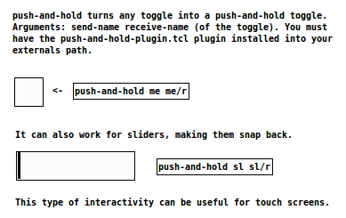

This is a GUI plugin for Pure Data which turns any toggle into a push-and-hold toggle.

To use it, install `push-and-hold-plugin.tcl` and instantiate the object `push-and-hold send-name receive-name`.

